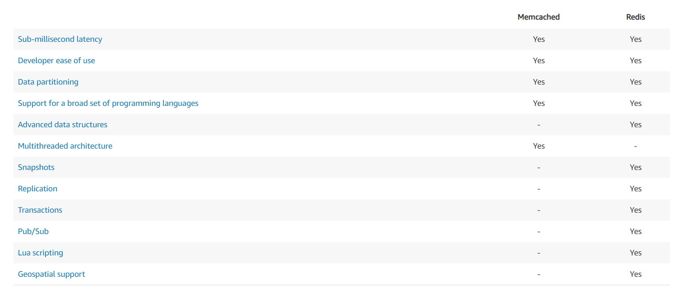
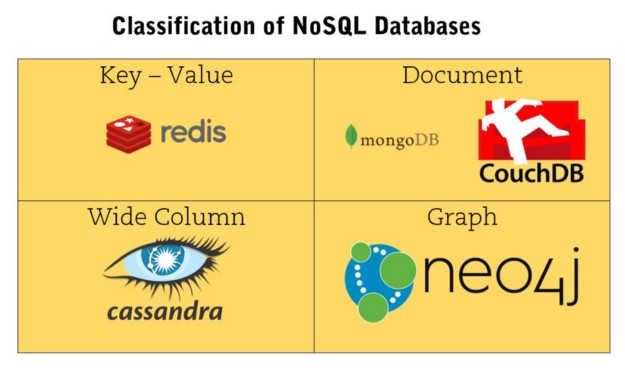
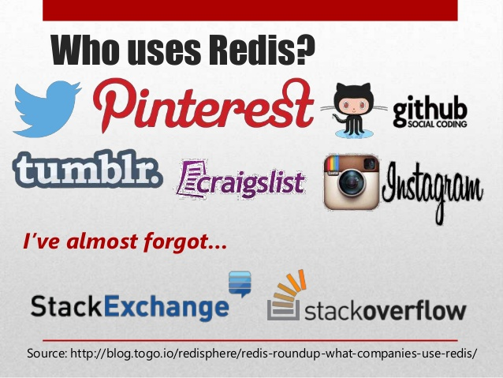
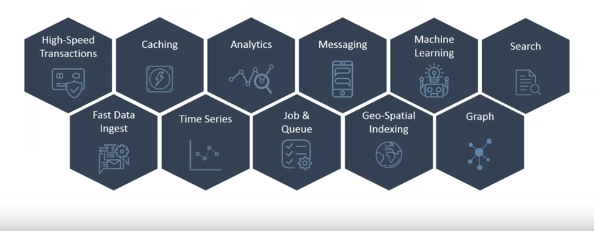
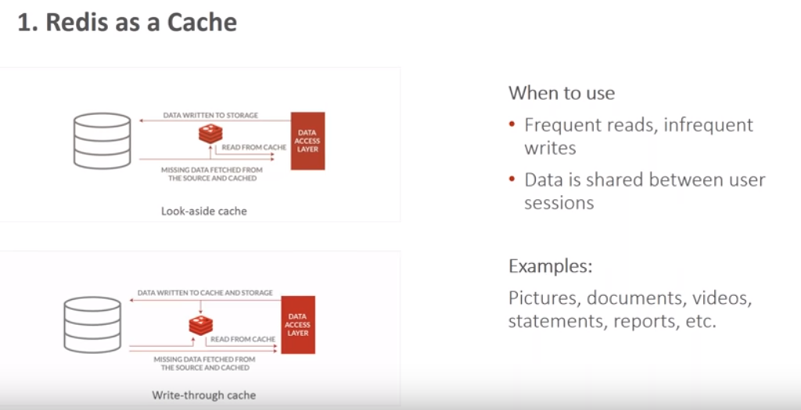

## Cache in Application

Imagine you are building a video streaming platform such as Youtube. Let us consider two basic features that the app will have:
* Uploading video -
Whenever someone uploads a video, the video will be stored in a database.
* View video -
multiple people should be able to search and watch uploaded videos.
Every time a person searches for a video title, application will fetch that video from database and will send it to the user. But if there are thousands of users requesting for the same video, your application will make similar calls to database and which will do same processing and return same result. The response will be slow, they will take a lot of bandwidth and database will do same heavy complex database queries (Such as JOINT queries) to search for the same video again and again while delaying the other concurrent requests to our web servers and databases.

What is caching and how it can solve our problem?
This is where Caching can help us. Caching is the process of saving intermediate or calculated values in memory temporarily. This speeds up the response because the previously saved computed values will simply be pulled from the cache memory every time there is a request for same search. Hence when a user searches for the video title which has already been cached, the response will be fast and the actual database will be free for executing other queries.

What are the advantages of Caching?
Faster response:
Since the cache is in-memory datastore, the results are sometimes 1000x faster than the results which we get from disk. Also it saves an entire network round trip to databases and complex queries
Avoid database being bottleneck:
Since data is fetched from cache database, network connected to database is not bloated with same requests.
Availability of data during network interruptions:
When there are network fluctuations between application and database, user can still view videos which are stored in cache database.

Are there any disadvantages?
Data inconsistency:
The major disadvantage of caching is that a client might be looking at stale data, which can happen because of a lack of proper updating. If there is any changes in data on database, they won’t reflect in cache until they are re-cached or updated.
Additional cost:
There is an extra cost to keep and maintain cache.

Cache Data adding strategies:
There are certain ways how we can add data in our cache database depends on our requirements, I have mentioned few most common data adding strategies.
Lazy loading:
Lazy Loading Cache is adding data to cache, only when it is first used. There are two ways of doing this:
Cache aside
- The application first checks the cache. If data is found in cache, it is returned to client, but if the data is not found in cache, Client queries the database, returns response to client where client stores the data in cache as well. This is the most frequently used strategy in Read heavy applications.


## What is Redis ?
Redis is a flexible, open-source (BSD licensed), in-memory data structure store, used as database, cache, and message broker. Redis is a NoSQL database so it facilitates users to store huge amount of data without the limit of a Relational database.

Redis supports various types of data structures like strings, hashes, lists, sets, sorted sets, bitmaps, hyperloglogs and geospatial indexes with radius queries.

As mentioned Redis is in-memory store where the data is isn’t written to disk but kept in volatile RAM. This in-memory feature makes extremely fast access to data and therefore Redis is frequently used as cache and as secondary database to support primary database. However some persistence measures can be taken to deal with server failures, primarily by writing to disk at regular interval. Some other use cases include real time applications as well as MessageQueue applications.

Redis is written in C and is mainly supported for Linux and related operating systems, but there are few ways to run Redis on Windows.

## Choosing between Redis and Memcached
Redis and Memcached are popular, open-source, in-memory data stores. Although they are both easy to use and offer high performance, there are important differences to consider when choosing an engine. Memcached is designed for simplicity while Redis offers a rich set of features that make it effective for a wide range of use cases. 




## Why Redis is different from other NoSQL databases ?


Most of these databases doesn’t exactly define database structure like tables nor support queries such as SQL SELECT. NoSQL allows less restrictions on schema as data is mostly stored in JSON objects.

Here Redis is key-value database as shown. Each value in the store is mapped by a key. These values can vary from each other and doesn’t follow any particular structure. However no value can be retrieved unless key is known.

 ## Features of Redis
 Following is the list of main features of Redis:

* Speed: Redis stores the whole dataset in primary memory that's why it is extremely fast. It loads up to 110,000 SETs/second and 81,000 GETs/second can be retrieved in an entry level Linux box. Redis supports Pipelining of commands and facilitates you to use multiple values in a single command to speed up communication with the client libraries.

* Persistence: While all the data lives in memory, changes are asynchronously saved on disk using flexible policies based on elapsed time and/or number of updates since last save. Redis supports an append-only file persistence mode. Check more on Persistence, or read the AppendOnlyFileHowto for more information.

* Data Structures: Redis supports various types of data structures such as strings, hashes, sets, lists, sorted sets with range queries, bitmaps, hyperloglogs and geospatial indexes with radius queries.

* Supported Languages: Redis supports a lot of languages such as ActionScript, C, C++, C#, Clojure, Common Lisp, D, Dart, Erlang, Go, Haskell, Haxe, Io, Java, JavaScript (Node.js), Julia, Lua, Objective-C, Perl, PHP, Pure Data, Python, R, Racket, Ruby, Rust, Scala, Smalltalk and Tcl.

## Redis Architecture
There are two main processes in Redis architecture:

* Redis Client
* Redis Server

 These client and server can be on same computer or two different computers.
 
 
 
Redis client and server can be in the same computer or in two different computers.

Redis server is responsible for storing data in memory. It handles all kinds of management and forms the major part of architecture. Redis client can be Redis console client or any other programming language’s Redis API.

As we saw that Redis stores everything in primary memory. Primary memory is volatile and therefore we will loose all stored data once we restart our Redis server or computer. Therefore we need a way for datastore persistance


## Redis vs RDBMS

Redis |	RDBMS
------|-------
Redis stores everything in primary memory.| 	RDBMS stores everything in secondary memory.
In Redis, Read and Write operations are extremely fast because of storing data in primary memory.	| In RDBMS, Read and Write operations are slow because of storing data in secondary memory.
Primary memory is in lesser in size and much expensive than secondary so, Redis cannot store large files or binary data.	| Secondary memory is in abundant in size and cheap than primary memory so, RDBMS can easily deal with these type of files.
Redis is used only to store those small textual information which needs to be accessed, modified and inserted at a very fast rate.If you try to write bulk data more than the available memory then you will receive errors. |	RDBMS can hold large data which has less frequently usage and not required to be very fast.

## Who uses Redis ?


## Use Case of Redis


## Redis as a Cache


## Designing Cache in Redis
* Identify the data that is repeatedly read by the application.
* Identify the right data structure
* Agree on value for time-to-live(TTL)
* Decide the eviction policy
* Implement the read/write logic


## Redis Installation
[Download For Windows](https://github.com/MicrosoftArchive/redis/releases)

Officially Redis doesn't have an official version for windows, but being an open source project, there is a fork by MSOpenTech where there is the possibility of running Redis on Windows.

In the GitHub page navigate to releases tab and find suitable version. Here choose from either .msior .zip installation files, where .zip file can be just expanded to use.

Just run redis-server.exe and the server will be exposed on 127.0.0.1 port 6379 by default.
The server should be kept running for the Redis database to be exposed.
In the same directory there is redis-cli.exe which is the client program to connect to Redis server. You could simply check whether that Redis server working properly by running ping command. Redis server would reply with PONG to ensure that it’s working perfectly.

Few more simple commands can be shown tried using Redis client.

set name "John" will insert record into Redis by ‘name’ key & ‘John’ as value.
By get name we will be able to get value of ‘name’ key.
incr & incrby operated on key ‘count’ without explicitly declaring as integer.
These Redis commands can also be tested inside the browser from [this](http://try.redis.io/) website. It’s easier to learn and play with Redis commands without any hassle.

## GUI client tool for Redis
Even though Redis provides great CLI tool to work with Redis, we prefer GUI application for the ease of use. One such GUI client tool for Windows is [Redis Desktop Manager](https://github.com/uglide/RedisDesktopManager/releases/tag/0.8.8).

### Redis Configuration

In Redis, there is a configuration file (redis.conf) available at the root directory of Redis. Although you can get and set all Redis configurations by Redis CONFIG command.
Syntax
Following is the basic syntax of Redis CONFIG command.
```
redis 127.0.0.1:6379> CONFIG GET CONFIG_SETTING_NAME
```
To get all configuration settings, use * in place of CONFIG_SETTING_NAME
```
redis 127.0.0.1:6379> CONFIG GET *
```
## Edit Configuration
To update configuration, you can edit redis.conf file directly or you can update configurations via CONFIG set command.
Note that modifying the configuration on the fly has no effects on the redis.conf file so at the next restart of Redis the old configuration will be used instead.

Syntax
Following is the basic syntax of CONFIG SET command.
```
redis 127.0.0.1:6379> CONFIG SET CONFIG_SETTING_NAME NEW_CONFIG_VALUE
```
## Persistence
Redis provides a different range of persistence options:

* Snapshotting

  By default Redis saves snapshots of the dataset on disk, in a binary file called dump.rdb. You can configure Redis to have it save the       dataset every N seconds if there are at least M changes in the dataset, or you can manually call the SAVE or BGSAVE commands.

  For example, this configuration will make Redis automatically dump the dataset to disk every 60 seconds if at least 1000 keys changed:
  ```
  save 60 1000
  ```
* AOF(Append-only File)

  Snapshotting is not very durable. If your computer running Redis stops, your power line fails, or you accidentally kill -9 your instance,     the latest data written on Redis will get lost. While this may not be a big deal for some applications, there are use cases for full         durability, and in these cases Redis was not a viable option.

  The append-only file is an alternative, fully-durable strategy for Redis. It became available in version 1.1.

  You can turn on the AOF in your configuration file:
  ```
  appendonly yes
  ```
  
## Security
Redis is designed to be accessed by trusted clients inside trusted environments. This means that usually it is not a good idea to expose the Redis instance directly to the internet or, in general, to an environment where untrusted clients can directly access the Redis TCP port or UNIX socket.

We can apply authentication by applying following command in redis.conf file :-
```
requirepass <your password>
```
To start client you need to provide :-
```
auth <your password>
```
Disabling of specific commands :- 
  it is possible to either rename or completely shadow commands from the command table
  ```
  rename-command CONFIG b840fc02d524045429941cc15f59e41cb7be6c52
  ```
  In the above example, the CONFIG command was renamed into an unguessable name. It is also possible to completely disable it (or any other     command) by renaming it to the empty string, like in the following example:
  ```
  rename-command CONFIG ""
  ```

## Monitor
MONITOR is a debugging command that streams back every command processed by the Redis server. It can help in understanding what is happening to the database.
The ability to see all the requests processed by the server is useful in order to spot bugs in an application both when using Redis as a database and as a distributed caching system.
```
monitor
```
  
## Redis Pub/Sub
Redis Pub/Sub implements the messaging system where the senders (in redis terminology called publishers) sends the messages while the receivers (subscribers) receive them. The link by which the messages are transferred is called channel.

There are definitely certain restrictions of using Redis Pub Sub as a Messaging System, it will not be like RabbitMQ, Kafka or Azure MessageBus etc. Those message bus are able to store the message for durability or even replay of an old message for consumption. Redis uses a listener model where there are no listeners (subscribers) it will not receive those messages. But if you wish to have a simple pub sub without the heavy tools then Redis does quite a good job at it.

Redis Pub Sub – Operations
  * PUBLISH channels message: Posts a message to the given channel
  * SUBSCRIBE [channel]: Subscribe to a given channel for message
  * PSUBSCRIBE [channel]: Subscribes the client to the given patterns
  * PUBSUB CHANNELS pattern: Currently active channels
  * PUBSUB NUMSUB channel: Number of subscribers to the channels provided
  * PUBSUB NUMPAT: Number of subscriptions to all the patterns
  * PUNSUBSCRIBE: Unsubscribes the client from a pattern
  * UNSUBSCRIBE: Unsubscribes the client from a channel

In Redis, a client can subscribe any number of channels.

Example
Following example explains how publish subscriber concept works. In the following example, one client subscribes a channel named ‘redisChat’.

```
redis 127.0.0.1:6379> SUBSCRIBE redisChat  
Reading messages... (press Ctrl-C to quit) 
1) "subscribe" 
2) "redisChat" 
3) (integer) 1
```

Now, two clients are publishing the messages on the same channel named ‘redisChat’ and the above subscribed client is receiving messages.

```
redis 127.0.0.1:6379> PUBLISH redisChat "Redis is a great caching technique"  
(integer) 1  
redis 127.0.0.1:6379> PUBLISH redisChat "I love Redis"  
(integer) 1   
1) "message" 
2) "redisChat" 
3) "Redis is a great caching technique" 
1) "message" 
2) "redisChat" 
3) "I love Redis"
```

## Implementing Pub/Sub

### Publisher

Mainly we are going to create three app servers. one is going to be a publisher and remaining two are subscribers.

```
npm init --yes
npm install express redis
```
create a file called server.js and add the following code.

```
const express = require('express');
const redis = require('redis');

const publisher = redis.createClient();

const app = express();

app.get('/',(req,res) => {
    const user = {
        id : "123456",
        name : "Davis"
    }

    publisher.publish("user-notify",JSON.stringify(user))
    res.send("Publishing an Event using Redis");
})

app.listen(3005,() => {
    console.log(`server is listening on PORT 3005`);
})
```


### Subscribers

create two express servers with the following code in different folder.
```
const express = require('express');
const redis = require('redis');

const subscriber = redis.createClient();

const app = express();

subscriber.on("message",(channel,message) => {
    console.log("Received data :"+message);
})

subscriber.subscribe("user-notify");

app.get('/',(req,res) => {
    res.send("Subscriber One");
})

app.listen(3006,() => {
    console.log("server is listening to port 3006");
})
```

```
const express = require('express');
const redis = require('redis');

const subscriber = redis.createClient();

const app = express();

subscriber.on("message",(channel,message) => {
    console.log("Received data :"+message);
})


app.get('/',(req,res) => {
    res.send("subscriber two");
})

subscriber.subscribe("user-notify");

app.listen(3007,() => {
    console.log("server is listening to port 3007");
})
```

Now you can run both publisher and subscribers. when you run the publisher, the publisher will publish the data to subscribers.


